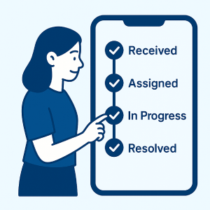

# Complaint Management Application

A full-stack Complaint Management System developed using Flutter, Next.js, Prisma, and Database integration.  
The application allows users to raise complaints while service providers and admins can manage, assign, and resolve complaints efficiently.

---

# Features

## User Module
- User Authentication
- Raise Complaints
- View Complaint Status
- Notifications
- Complaint History
- Profile Management
- Complaint Details View

## Service Provider Module
- Service Provider Login
- Pending Complaints Dashboard
- Completed Complaints Dashboard
- OTP Verification
- Before/After Complaint Process
- Complaint Resolution Workflow
- Profile Management

## Admin Module
- Staff Management
- Assign Complaints
- Banner Management
- Notification Management
- Profession Management
- Complaint Tracking

---

# Tech Stack

## Frontend
- Flutter
- Dart
- Material UI

## Backend
- Next.js
- REST APIs
- Prisma ORM

## Database
- MySQL / PostgreSQL

## Other Tools
- Shared Preferences
- Git & GitHub

---

# Project Architecture

Flutter App → Next.js API → Prisma ORM → Database

---

# Folder Structure

```bash
COMPLAINT_MANAGEMENT_APP/
│
├── assets/
│
├── lib/
│   │
│   ├── User/
│   │   └── Presentation/
│   │       ├── Constants/
│   │       └── UI/
│   │
│   ├── ServiceProvider/
│   │   └── Presentation/
│   │       ├── Constants/
│   │       └── UI/
│   │
│   ├── main.dart
│   └── api_service_baseurl.dart
│
├── android/
├── ios/
├── web/
└── README.md
```

---

# Main Functionalities

## Complaint Workflow
1. User raises complaint
2. Admin assigns complaint
3. Service provider accepts complaint
4. OTP verification process
5. Before/After image upload
6. Complaint resolution
7. Complaint marked completed

---

# Screenshots

## User Home Screen


---

## Complaint Dashboard


---

## Complaint Details



---

# Backend Setup

## Install Dependencies

```bash
npm install
```

## Run Backend

```bash
npm run dev
```

Backend runs on:

```bash
http://localhost:3000
```

---

# Frontend Setup

## Install Flutter Packages

```bash
flutter pub get
```

## Run Flutter App

```bash
flutter run
```

---

# API Configuration

Update API Base URL inside:

```bash
lib/api_service_baseurl.dart
```

Example:

```dart
const String baseUrl = "http://localhost:3000/api/";
```

---

# Database Setup

## Prisma Migration

```bash
npx prisma migrate dev
```

## Generate Prisma Client

```bash
npx prisma generate
```

---

# Technologies Used

- Flutter
- Dart
- Next.js
- Prisma
- REST APIs
- MySQL
- Shared Preferences
- GitHub

---

# Future Improvements

- Push Notifications
- AI-based Complaint Categorization
- Analytics Dashboard
- Dark Mode
- Real-time Complaint Tracking

---

# Author

Rishita Bohra

GitHub:
https://github.com/RishitaBohra

---

# License

This project is for educational and portfolio purposes.
